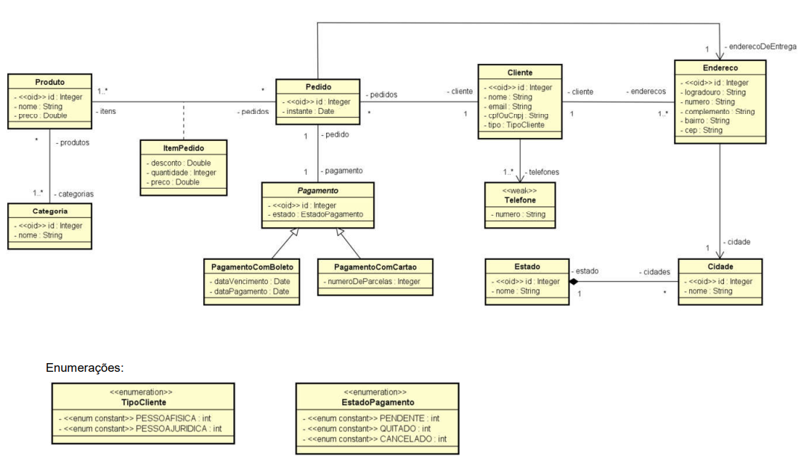

## Modelagem de Dados UML (Análise&Projeto Orientado a Objetos)
[Curso](https://www.udemy.com/course/uml-diagrama-de-classes/) completo de **modelagem conceitual** com **UML**. Teoria e prática! Bônus: projeto Java, Spring Boot e Hibernate/JPA  
Criado por: [@acenelio](https://github.com/acenelio)

### Assets
Na pasta [./assets](./assets) você pode encontrar os `.pdfs` e `.drawio` (*Utilizei [Draw.io - VsCode](https://marketplace.visualstudio.com/items?itemName=hediet.vscode-drawio) para modelar*) com os **slides da aula**, **exercicios** e **resoluções dos exercicios**.

### Estudo de caso

> Modelo conceitual implementado.

### Implementação
[Implementação](./cursomc) do estudo de caso acima.

### Descricao do curso
O **Modelo Conceitual**, também chamado de **Modelo de Domínio em nível de análise**, é uma descrição das informações que o sistema vai gerenciar. 

Por muitos anos o modelo conceitual tem sido representado pelo modelo **Entidade-relacionamento**, criado por Peter Chen, que em seguida é convertido para o modelo relacional para implementação em banco de dados relacional. Esta abordagem segue o chamado **Paradigma Estruturado**. É uma abordagem consistente e muito usada ainda nos dias atuais.

Entretanto, com a evolução das plataformas orientadas a objetos e das técnicas e ferramentas de **mapeamento objeto-relacional (ORM)**, tornou-se muito viável a implementação de modelos de domínio em linguagens orientadas a objetos, de modo a explorar os benefícios do **Paradigma Orientado a Objetos**, paradigma este mais sofisticado que o estruturado, e que permite soluções elegantes e flexíveis para várias situações.

Dentro do Paradigma Orientado a Objetos, a ferramenta que se consolidou como padrão para desenhar diversos tipos de artefatos é a **UML - Unified Modeling Language**. A UML possui diversos **diagramas** que servem para representar inúmeras coisas, especialmente artefatos de sistemas orientados a objetos.

Neste curso, nós vamos aprender a criar modelos conceituais utilizando o chamado **Diagrama de Classes** da UML, a partir de descrições em estilo "Visão geral de sistema". Vamos aprender a modelar **conceitos**, **atributos** e **associações**. Vamos aprender também a identificar as **multiplicidades** dos **papéis** em uma associação. Além disso, vamos aprender vários recursos de modelagem conceitual com UML tais como: **agregação** e **composição**, **herança**, **classes de associação**, **enumerações** e **tipos primitivos**.

Ao final do curso, para mostrar como tudo que foi ensinado possui aplicação prática de mercado, vamos fazer um **estudo de caso** completo no qual vamos implementar um modelo conceitual de significativa complexidade utilizando padrão de mercado e boas práticas. Vamos utilizar a plataforma **Java**, com **Spring Boot** e **JPA**. Vamos implementar o modelo completo, criar uma instância do modelo com Java em nosso próprio sistema, e vamos gerar a base de dados relacional automaticamente. Por fim, vamos disponibilizar endpoints **REST** para recuperar e apresentar os dados em formato **JSON**.

Tenho certeza que este curso vai agregar valiosos conhecimentos sobre modelagem de domínio em nível de análise, e também te elevará a um grau de compreensão superior sobre esta importante disciplina. Não perca mais tempo: comece já este curso.
